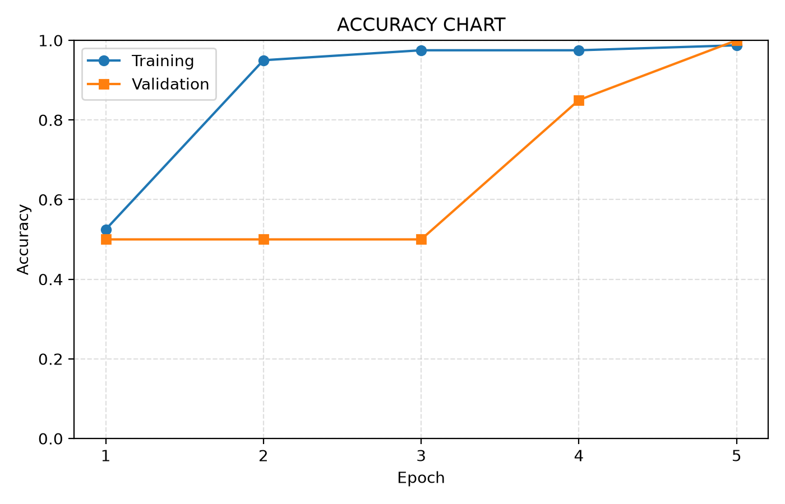
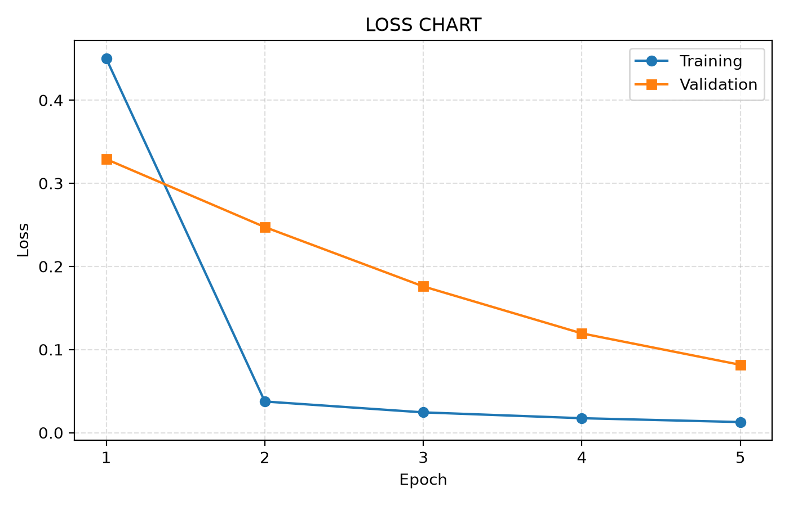

# Binary Classification of Iris Data - Single Layer Perceptron

Tugas Pembelajaran Mesin Mendalam (Deep Learning) yang mengimplementasikan Single Layer Perceptron (SLP) untuk klasifikasi biner Iris-setosa dan Iris-versicolor.

Nama: Jessy Marcia
NIM: 24/538431/PA/22846
Mata Kuliah: Deep Learning

## Spesifikasi Model

| Arsitektur | 4 input → 1 neuron output |
| Aktivasi | Sigmoid, g(z) = 1 / (1 + e^-z) |
| Prediksi | 1 jika g(z) > 0.5, selain itu 0 |
| Label | Iris-setosa = 0, Iris-versicolor = 1 |
| Bobot awal | bias = θ1 = θ2 = θ3 = θ4 = 0.5 |
| Learning rate | 0.1 |
| Epoch | 5 |
| Loss | Mean Squared Error: mean((g(z) − y)²) |
| Update | Stochastic Gradient Descent (per baris data) |
| Split data | 80 training (40+40), 20 validation (10+10), tanpa shuffle |

Gradien yang digunakan: 
d = 2 * (g(z) − y) * (1 − g(z)) * g(z)
bias = bias - lr * d
θi = θi - lr * d * xi

Validasi pada epoch ke-k memakai bobot hasil akhir training epoch ke-k, tanpa update bobot.


## Struktur File

| `iris_binary.csv` | 100 baris data (kolom X1, X2, X3, X4, species) |
| `slp_iris.py` | kode utama: load data, training, evaluasi, chart |
| `metrics.csv` | output: accuracy & loss per epoch |
| `accuracy_chart.png` | output: grafik accuracy |
| `loss_chart.png` | output: grafik loss |

## Cara Menjalankan
```bash
pip install numpy pandas matplotlib
python slp_iris.py
```

## Hasil
epoch  train_accuracy  train_loss  val_accuracy  val_loss
     1          0.5250    0.449889          0.50  0.328951
     2          0.9500    0.037452          0.50  0.247289
     3          0.9750    0.024372          0.50  0.175892
     4          0.9750    0.017357          0.85  0.119381
     5          0.9875    0.012740          1.00  0.081581
Identik dengan perhitungan yang dilakukan di Google Sheets




## Link

- Google Sheets: ([PMM-TemplateSLP-Jessy](https://docs.google.com/spreadsheets/d/1dye4vzixR_oD0_iw7z7M3YrlppGyiSG7/edit?gid=127063984#gid=127063984))